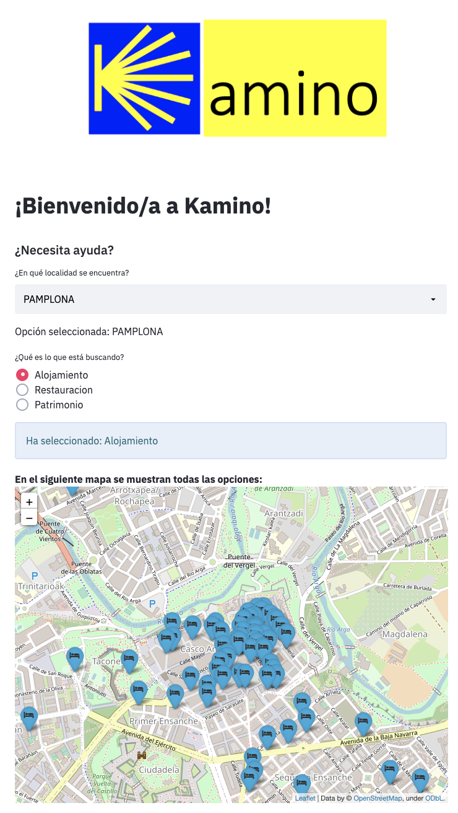

# Kamino

Proyecto final del Bootcamp Data Analytics de [Ironhack Madrid](https://www.ironhack.com/es).

## Contexto

El Camino de Santiago ha sido, y sigue siendo, la ruta más antigua y concurrida de Europa. 

Las razones por la que el Camino surgió en su momento fueron: 

- la visita a la Catedral de Santiago y rogar por el perdón de los pecados
- santiguarse para una batalla futura
- rezar por curas milagrosas
- visitar los restos del Apóstol que descansan en la Catedral. 

En la actualidad, existen también otras razones: 
- Vivir una nueva aventura
- Superación personal
- Disfrutar de su patrimonio cultural 

Según datos de la [Observatorio Turístico de Navarra](https://www.turismo.navarra.es/esp/profesionales/Observatorio-turistico/presentacion/presentacion);

- En **2019**, el **20** de los/as peregrinos/as tenían **más de 60 años.**	

## ¿Qué es Kamino?

Una herramienta de soporte enfocada a  peregrinos/as mayores de 60 años.

Kamino, ofrece de una manera fácil y visual, respuestas a sus necesidades; 

¿Dónde dormir?

¿Dónde comer?

¿Qué ver?

## ¿Cómo funciona?

El peregrino confirma en la localidad en la que se encuentra.

Seguidamente, confirma qué es lo que está buscando.

Finalmente se muestra un mapa con los puntos.

### Instalaciones necesarias

    pip install -r requirements.txt

